  

---

# 👋 Merhaba, ben Aysun

İnönü Üniversitesi **Yazılım Mühendisliği** öğrencisiyim.

Backend geliştirme, sistem tasarımı, veritabanı mimarisi ve güvenli yazılım geliştirme süreçleri üzerine çalışıyorum.

Projelerimde sadece çalışan kod üretmeye değil; **okunabilir, sürdürülebilir ve ölçeklenebilir sistemler** tasarlamaya önem veriyorum.

Ana çalışma alanlarım:

- Java & Spring Boot tabanlı backend geliştirme
- REST API tasarımı
- Katmanlı mimari
- Veritabanı modelleme
- UML ve sistem analizi
- Güvenli yazılım geliştirme

---

# 🚀 İlgi Alanlarım

<table>

<tr>

<td width="25%" align="center">

  

Java  
Spring Boot  
REST API  
MVC  

</td>

<td width="25%" align="center">

  

UML  
ER Diagram  
Architecture  
Design Patterns  

</td>

<td width="25%" align="center">

  

SQL  
PostgreSQL  
Data Modeling  
Optimization  

</td>

<td width="25%" align="center">

  

Secure Systems  
Data Protection  
Cyber Security  

</td>

</tr>

</table>

---

# 🛠️ Teknoloji Stack

 

 

---

# 📌 Öne Çıkan Projeler

<table>

<tr>

<td width="50%" valign="top">

## 🚆 T-MES Lite

**Mesai ve vardiya takip sistemi**

Çalışanların planlı vardiyalarını görüntüleyebildiği, mesai başlangıç/bitiş talepleri oluşturabildiği ve yöneticilerin onay sürecini yönettiği backend odaklı sistem.

**Odak Alanları**

- Spring Boot
- REST API
- Rol bazlı yetkilendirme
- İş akışı yönetimi
- Sistem tasarımı

</td>

<td width="50%" valign="top">

## 🎓 EduConnect

**Online eğitim platformu**

Öğrenci ve eğitmen etkileşimi üzerine geliştirilen, backend mimarisi ve API tasarımına odaklanan eğitim platformu.

**Odak Alanları**

- Java
- Spring Boot
- MVC Architecture
- REST API

</td>

</tr>

<tr>

<td width="50%" valign="top">

## 🌱 Yeşil-Zincir

**Blockchain + IoT + QR tabanlı gıda izlenebilirlik sistemi**

Gıda ürünlerinin üretimden tüketiciye kadar olan yolculuğunu takip etmeyi amaçlayan, güvenilir veri akışı ve şeffaflık üzerine kurgulanmış proje.

**Odak Alanları**

- Blockchain mantığı
- IoT sensör verileri
- QR tabanlı takip sistemi
- Veri güvenliği
- Kullanıcı deneyimi

</td>

<td width="50%" valign="top">

## 🛍️ Swaply

**İkinci el ürün alım-satım platformu**

Kullanıcı deneyimi, arayüz tasarımı ve sistem akışı üzerine geliştirilen UI/UX odaklı proje.

**Odak Alanları**

- Figma
- Kullanıcı akışı
- Arayüz tasarımı
- Sistem analizi

</td>

</tr>

<tr>

<td width="50%" valign="top">

## ⏱️ In-Memory Task Scheduler

**Java tabanlı görev zamanlayıcı**

Bellek üzerinde görev yönetimi gerçekleştiren, nesne yönelimli programlama prensipleri ve tasarım desenleri kullanılarak geliştirilen backend uygulaması.

**Odak Alanları**

- Java OOP
- Builder Pattern
- Observer Pattern
- Clean Code

</td>

<td width="50%" valign="top">

## 🗄️ LMS Veritabanı Projesi

**İlişkisel veritabanı tasarımı**

Öğrenci, ders ve akademik süreçlerin modellenmesi üzerine hazırlanmış veritabanı tasarım çalışması.

**Odak Alanları**

- SQL
- ER Diagram
- Database Design
- Relational Modeling

</td>

</tr>

</table>

---

# 🎓 Kampüs Temsilciliği

<table>

<tr>

<td width="30%" align="center">

</td>

<td width="70%">

## PythianGo Digital Career Platform

### İnönü Üniversitesi Kampüs Temsilcisi

Teknoloji, kariyer ve eğitim fırsatlarının öğrencilere ulaştırılması için kampüs içerisinde iletişim ve organizasyon süreçlerine katkı sağlıyorum.

Bu rol kapsamında:

- Teknoloji etkinliklerinin duyurulması
- Kariyer fırsatlarının paylaşılması
- Öğrenci topluluk iletişimi
- Eğitim içeriklerinin yaygınlaştırılması

</td>

</tr>

</table>

---

# 📚 Sertifikalar ve Öğrenme Alanları

<table>

<tr>

<td width="33%" valign="top">

 

**Cybersecurity Essentials**  
Linux Foundation, 2026

**Cybersecurity Fundamentals**  
IBM SkillsBuild, 2026

</td>

<td width="33%" valign="top">

 

**Python Programlama Dili**  
BTK Akademi, 2025

**Python ile Yapay Zeka I**  
Techcareer.net, 2025

**Yapay Zeka Mini Eğitim Kampı**  
Miuul, 2025

</td>

<td width="33%" valign="top">

 

**Enterprise Design Thinking Practitioner**  
IBM, 2026

**Explore Emerging Tech**  
IBM, 2026

**PythianGo Campus Representative**  
İnönü Üniversitesi

</td>

</tr>

</table>

---

# 📊 Profil Özeti

<table>

<tr>

<td width="33%" align="center">

## 🎓 Eğitim

**Yazılım Mühendisliği**

İnönü Üniversitesi

</td>

<td width="33%" align="center">

## 💻 Uzmanlık

**Backend Development**

Java  
Spring Boot  
REST API

</td>

<td width="33%" align="center">

## 🔐 Odak Alanı

**Secure Software**

Cyber Security  
Data Protection

</td>

</tr>

</table>

---

 

### Learning. Building. Growing.

 

